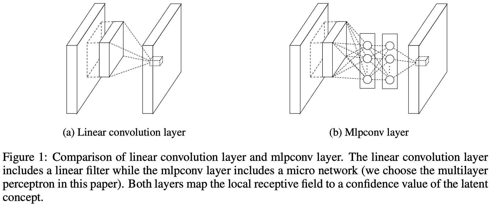

[TensorFlow 2] Network In Network
=====

## Concept
<div align="center">
    
  <p>Concept of Network-in-Network (NiN) [1].</p>
</div>

## Performance

|Indicator|Value|
|:---|:---:|
|Accuracy|0.99420|
|Precision|0.99414|
|Recall|0.99429|
|F1-Score|0.99421|

```
Confusion Matrix
[[ 980    0    0    0    0    0    0    0    0    0]
 [   0 1122    0    2    3    0    3    3    1    1]
 [   0    0 1028    0    0    0    0    3    1    0]
 [   0    0    1 1003    0    5    0    1    0    0]
 [   0    0    1    0  979    0    0    0    0    2]
 [   0    0    0    4    0  887    1    0    0    0]
 [   4    0    1    1    0    0  951    0    1    0]
 [   0    1    1    0    0    0    0 1026    0    0]
 [   0    0    0    0    0    1    0    0  973    0]
 [   1    0    1    1    8    0    0    2    3  993]]
Class-0 | Precision: 0.99492, Recall: 1.00000, F1-Score: 0.99746
Class-1 | Precision: 0.99911, Recall: 0.98855, F1-Score: 0.99380
Class-2 | Precision: 0.99516, Recall: 0.99612, F1-Score: 0.99564
Class-3 | Precision: 0.99209, Recall: 0.99307, F1-Score: 0.99258
Class-4 | Precision: 0.98889, Recall: 0.99695, F1-Score: 0.99290
Class-5 | Precision: 0.99328, Recall: 0.99439, F1-Score: 0.99384
Class-6 | Precision: 0.99581, Recall: 0.99269, F1-Score: 0.99425
Class-7 | Precision: 0.99130, Recall: 0.99805, F1-Score: 0.99467
Class-8 | Precision: 0.99387, Recall: 0.99897, F1-Score: 0.99642
Class-9 | Precision: 0.99699, Recall: 0.98414, F1-Score: 0.99052

Total | Accuracy: 0.99420, Precision: 0.99414, Recall: 0.99429, F1-Score: 0.99421
```

## Requirements
* Python 3.7.6  
* Tensorflow 2.1.0  
* Numpy 1.18.1  
* Matplotlib 3.1.3  

## Reference
[1] Min Lin et al. (2013). <a href="https://arxiv.org/abs/1312.4400">Network In Network</a>. arXiv preprint arXiv:1312.4400.
